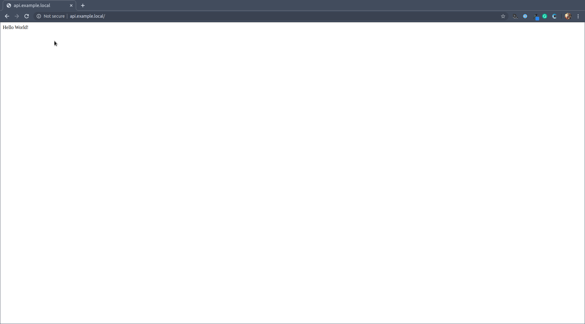

# Docker Utils Example

> An example project demonstrating the usage of https://github.com/41north/docker-utils


[](https://github.com/41north/docker-utils/graphs/contributors/)

## Description

This repository demonstrates how to use [docker-utils](https://github.com/41north/docker-utils) when developing a full-stack node based application.
It includes:

* Traefik reverse proxy for exposing services
* Postgres database and PgWeb admin panel
* NestJS based API starter
* React starter app 

## Prerequisites

Before continuing you will need to ensure you have the following the instructions detailed [here](https://github.com/41north/docker-utils).

## Installation

The first time you cd into the root directory in a terminal you should be prompted with the following:

```shell
direnv: error .envrc is blocked. Run `direnv allow` to approve its content.    
```

Follow the instructions and run `direnv allow`. You should then see the following output:

```shell
direnv: loading .envrc                                                                                                                                                                                                                 
direnv: export +BASE_DOMAIN +ENV_FILE +NODE_VERSION +POSTGRES_DB +POSTGRES_PASSWORD +POSTGRES_USER +POSTGRES_VERSION +REPO_ROOT_DIR ~PATH
```

Next checkout the `docker-utils` submodule by running the following:

```shell
git submodule update --init --recursive
```

There should now be a `docker-utils` folder within the root directory.

Add the following entries to your `/etc/hosts` file:

```bash
127.0.0.1       example.local
127.0.0.1       api.example.local
127.0.0.1       pgweb.example.local
```

Finally, from the root directory of your repository, execute the following:

```shell
docker-compose up -d
```

You can check the status of the services by running `docker-compose logs -f --tail 100`. After a minute or two you should 
be able to access the following from browser:

Traefik Admin [http://localhost:8080](http://localhost:8080)


PG Web [http://pgweb.example.local](http://pgweb.example.local)


API [http://api.example.local](http://api.example.local)



Frontend [http://example.local](http://example.local)
 

 
### Note

This example is not a turn-key solution for developing a full stack app. The API and frontend are the result of running
the starter apps for React and NestJS and are only intended to demonstrate the initial setup via docker compose and 
the helper scripts for executing commands against the API and frontend respectively. 

Further work would be required to install and configure an ORM, database migrations and so on and is considered outside
the scope of this example.  

## Usage

To execute scripts defined within the scripts section of the `package.json` file for the `client` or `api` project you
can simply cd into those directories and execute the commands normally. 

The helper scripts located in `docker-utils/bin`, which
have been added to your path by `.envrc` and override any locally installed versions of `yarn` or `npm`, have been configured to 
provide a consistent environment between your local machine and the docker containers that have been configured via docker-compose.

In addition, if you wished to develop the client without spinning up an environment via docker-compose, you cd into the `client` 
directory and run the following:

```shell
╭─brian@alpha ~/Development/41north/docker-utils-example/client ‹master*› 
╰─$ yarn start
yarn run v1.22.0
$ react-scripts start
ℹ ｢wds｣: Project is running at http://192.168.1.89/
ℹ ｢wds｣: webpack output is served from 
ℹ ｢wds｣: Content not from webpack is served from /usr/src/app/public
ℹ ｢wds｣: 404s will fallback to /
Starting the development server...
Compiled successfully!

You can now view client in the browser.

  Local:            http://localhost:3000
  On Your Network:  http://192.168.1.89:3000

Note that the development build is not optimized.
To create a production build, use yarn build.
```

You can access the frontend via [http://localhost:3000](http://localhost:3000) as you would normally, without the need to install `node` or `yarn`.

The version for the node image is controlled via the `.env` file.  
